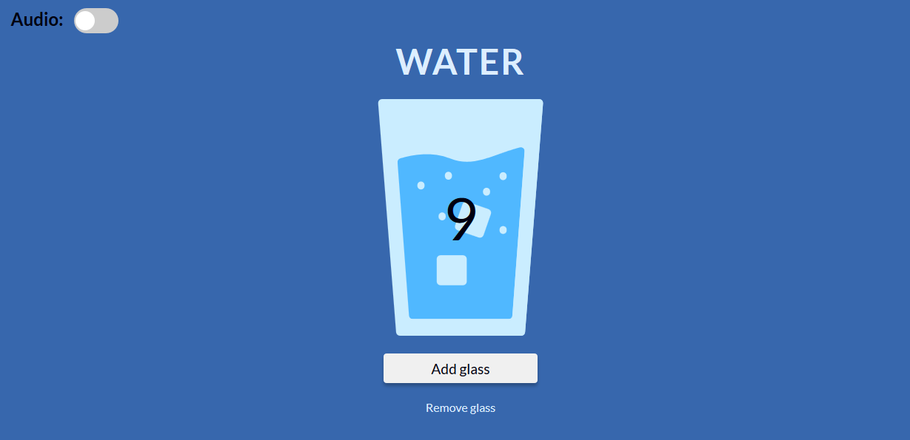

# water-application supported with local storage

to run locally -> 

`npm install -g gulp-cli`

`npm install`

`gulp`

Inspired from WTF frontend course.

# Technologies and tools
* JS ES6
* HTML 5
* CSS 3 SCSS
  * flexbox
  * sass BEM  
  * transitions (animate SVG image)
* npm
* GIT
* Node.js / NPM
* Gulp
* Figma (layout design)
* PWA APP

# Contact
 feel free to contact me! 
